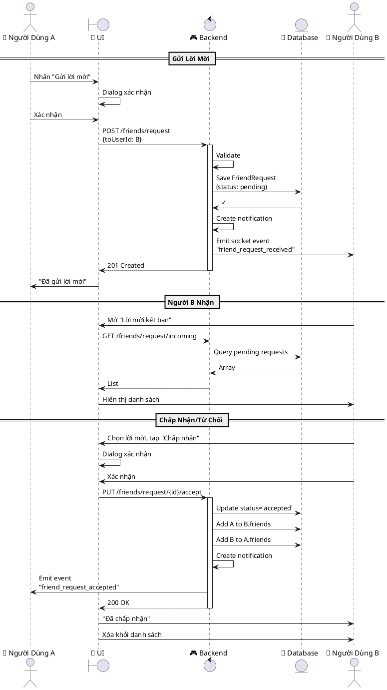
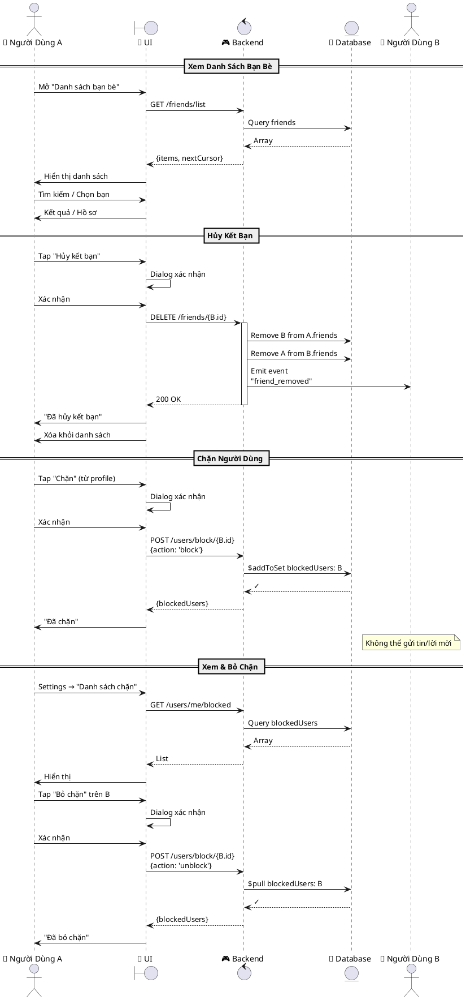
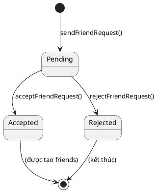

# UML DIAGRAMS - UC04 & UC05

---

## 1. SEQUENCE DIAGRAM: UC04 - Quản Lý Lời Mời Kết Bạn



---

## 2. SEQUENCE DIAGRAM: UC05 - Quản Lý Bạn Bè



---

## 3. ACTIVITY DIAGRAM: UC04 - Quản Lý Lời Mời

```plantuml
@startuml UC04_Activity

start

activity "Người A xem danh sách\nhoặc hồ sơ" as A1
activity "Nhấn 'Gửi lời mời'" as A2
activity "Dialog xác nhận" as A3
activity "Xác nhận" as A4
decision "Hợp lệ?" as D1
activity "POST /friends/request" as A5
activity "Lưu FriendRequest\n(pending)" as A6
activity "Gửi thông báo\ntới Người B" as A7
activity "Hiển thị 'Đã gửi'" as A8
activity "Hiển thị lỗi\nvà thử lại" as A9

A1 --> A2
A2 --> A3
A3 --> A4
A4 --> D1
D1 -->|Yes| A5
D1 -->|No| A9
A5 --> A6
A6 --> A7
A7 --> A8
A8 --> end
A9 --> end

partition "Phía Người B" {
  activity "Nhận thông báo" as B1
  activity "Mở 'Lời mời'" as B2
  activity "GET /incoming" as B3
  activity "Hiển thị danh sách" as B4
  activity "Chọn: Chấp nhận\nhoặc Từ chối" as B5
  decision "Hành động?" as D2
  activity "PUT /accept\nThêm friends\nGửi notification" as B6
  activity "PUT /reject" as B7
  activity "Hiển thị thành công" as B8
  
  B1 --> B2
  B2 --> B3
  B3 --> B4
  B4 --> B5
  B5 --> D2
  D2 -->|Chấp nhận| B6
  D2 -->|Từ chối| B7
  B6 --> B8
  B7 --> B8
  B8 --> end
}

@enduml
```

---

## 4. ACTIVITY DIAGRAM: UC05 - Quản Lý Bạn Bè

```plantuml
@startuml UC05_Activity

start

activity "Vào Bạn Bè\nSettings" as Start

Start --> Fork

fork
  partition "📋 Xem Danh Sách" {
    activity "GET /friends/list" as V1
    activity "Hiển thị danh sách" as V2
    activity "Tìm kiếm hoặc\nchọn bạn" as V3
    V1 --> V2
    V2 --> V3
    V3 --> end
  }
fork again
  partition "🚫 Hủy Kết Bạn" {
    activity "Tap 'Hủy kết bạn'" as R1
    activity "Dialog xác nhận" as R2
    activity "Xác nhận" as R3
    activity "DELETE /friends/{id}" as R4
    activity "Xóa khỏi cả 2\nfriends list" as R5
    activity "Emit event" as R6
    activity "Hiển thị 'Đã hủy'" as R7
    R1 --> R2
    R2 --> R3
    R3 --> R4
    R4 --> R5
    R5 --> R6
    R6 --> R7
    R7 --> end
  }
fork again
  partition "🚫 Chặn Người Dùng" {
    activity "Tap 'Chặn'" as B1
    activity "Dialog xác nhận" as B2
    activity "Xác nhận" as B3
    activity "POST /block\n{action: 'block'}" as B4
    activity "Thêm vào\nblockedUsers" as B5
    activity "Hiển thị 'Đã chặn'" as B6
    B1 --> B2
    B2 --> B3
    B3 --> B4
    B4 --> B5
    B5 --> B6
    B6 --> end
  }
fork again
  partition "✅ Bỏ Chặn" {
    activity "Vào 'Danh sách chặn'" as U1
    activity "GET /me/blocked" as U2
    activity "Hiển thị" as U3
    activity "Tap 'Bỏ chặn'" as U4
    activity "Dialog xác nhận" as U5
    activity "Xác nhận" as U6
    activity "POST /block\n{action: 'unblock'}" as U7
    activity "Xóa khỏi\nblockedUsers" as U8
    activity "Hiển thị 'Đã bỏ'" as U9
    U1 --> U2
    U2 --> U3
    U3 --> U4
    U4 --> U5
    U5 --> U6
    U6 --> U7
    U7 --> U8
    U8 --> U9
    U9 --> end
  }
end fork

stop

@enduml
```

---

## 5. STATE DIAGRAM: FriendRequest



---

## Hướng Dẫn Vẽ Diagram

### 📝 Các công cụ:

1. **PlantUML Web:** https://www.plantuml.com/plantuml/uml/
   - Copy code vào
   - Nhấn export PNG/SVG

2. **PlantUML App (desktop)**
   - VS Code: Cài extension "PlantUML"
   - Alt+D preview

3. **draw.io/Lucidchart**
   - Copy PlantUML vào sẽ tự convert

### 📌 Cách copy:

1. Copy code từ section trên
2. Paste vào tool (ví dụ plantuml.com)
3. Export thành PNG/SVG
4. Thêm vào document

---
