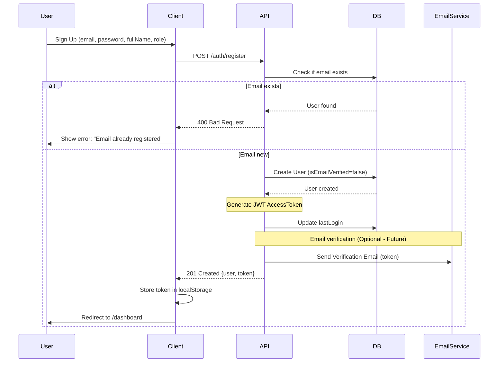
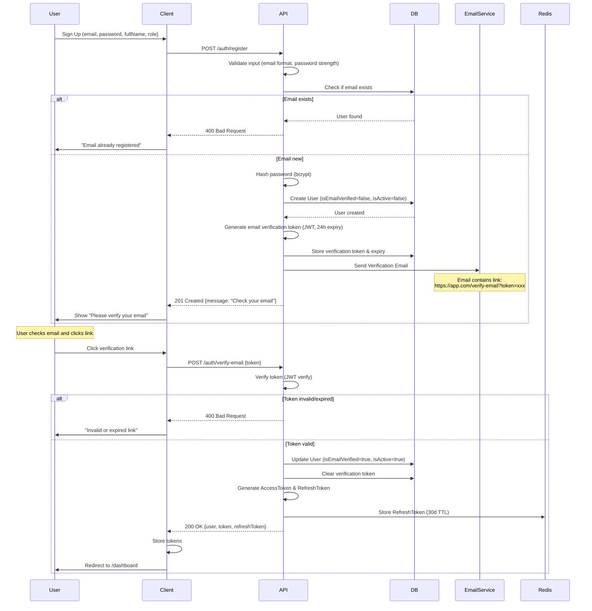
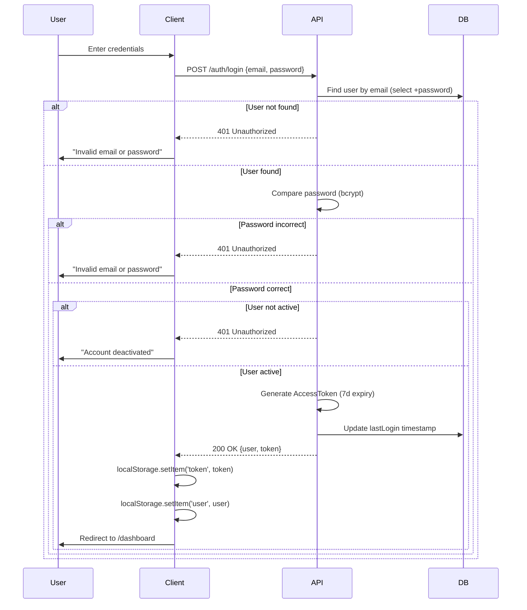
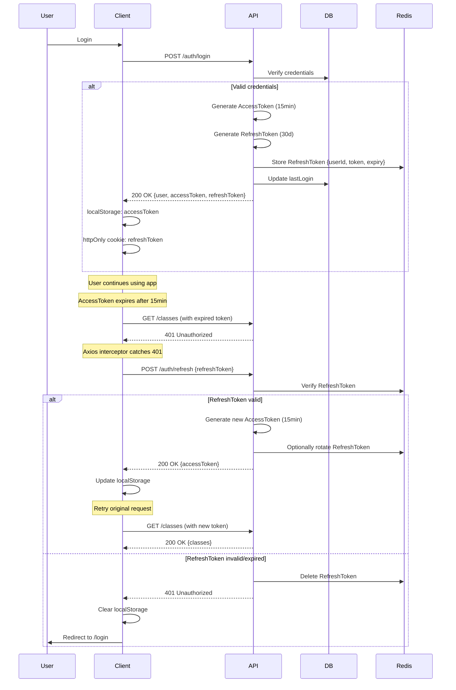
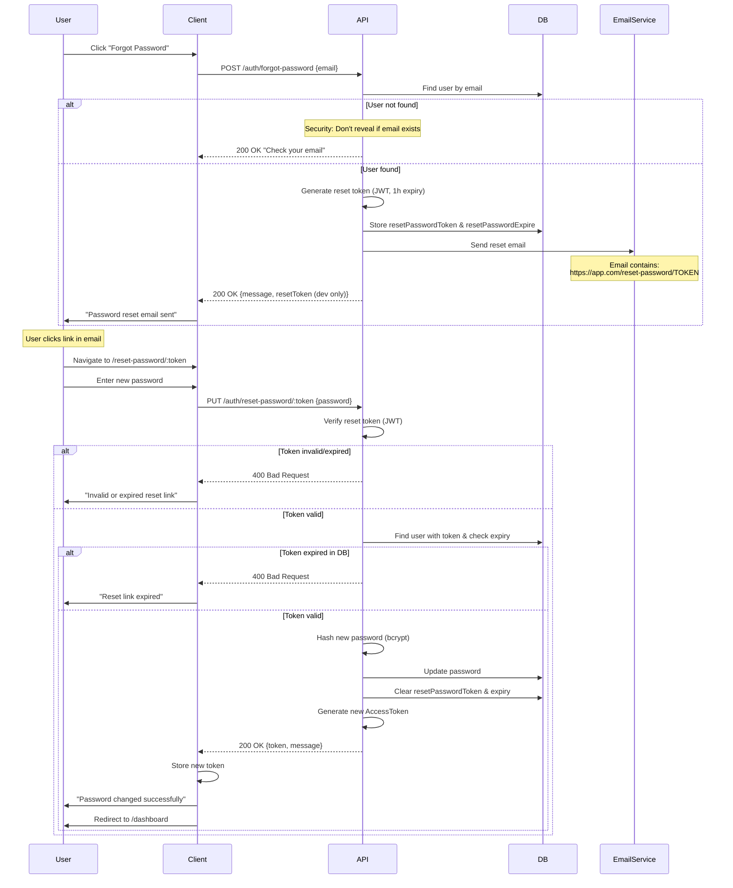
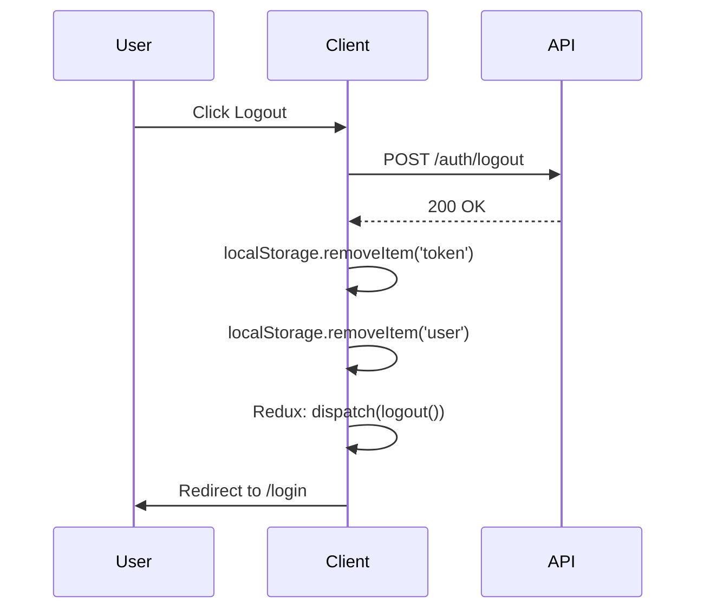
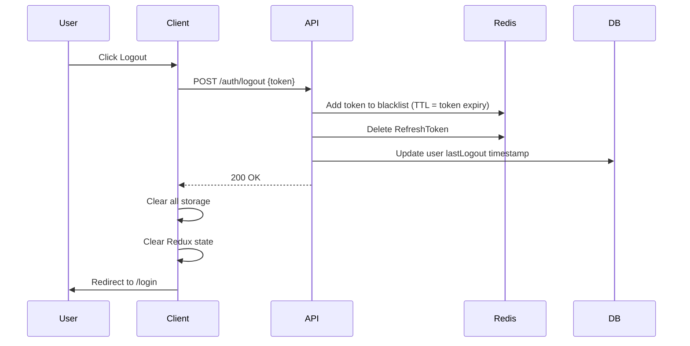
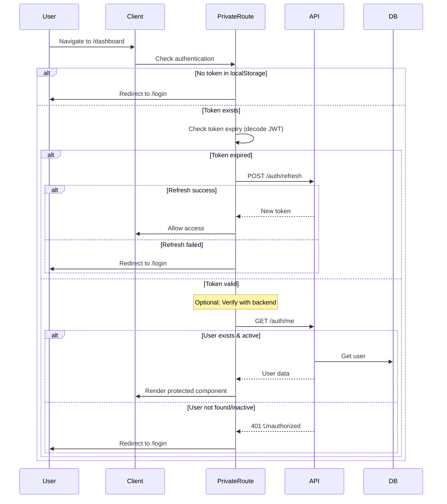
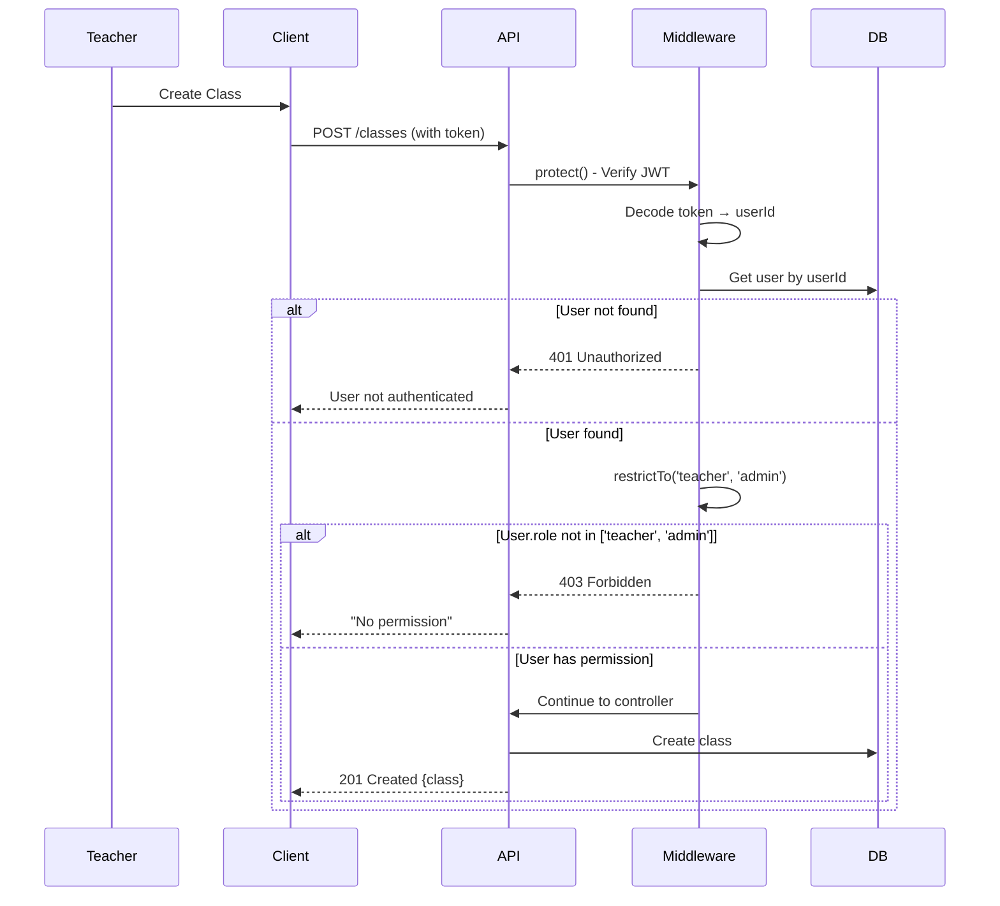
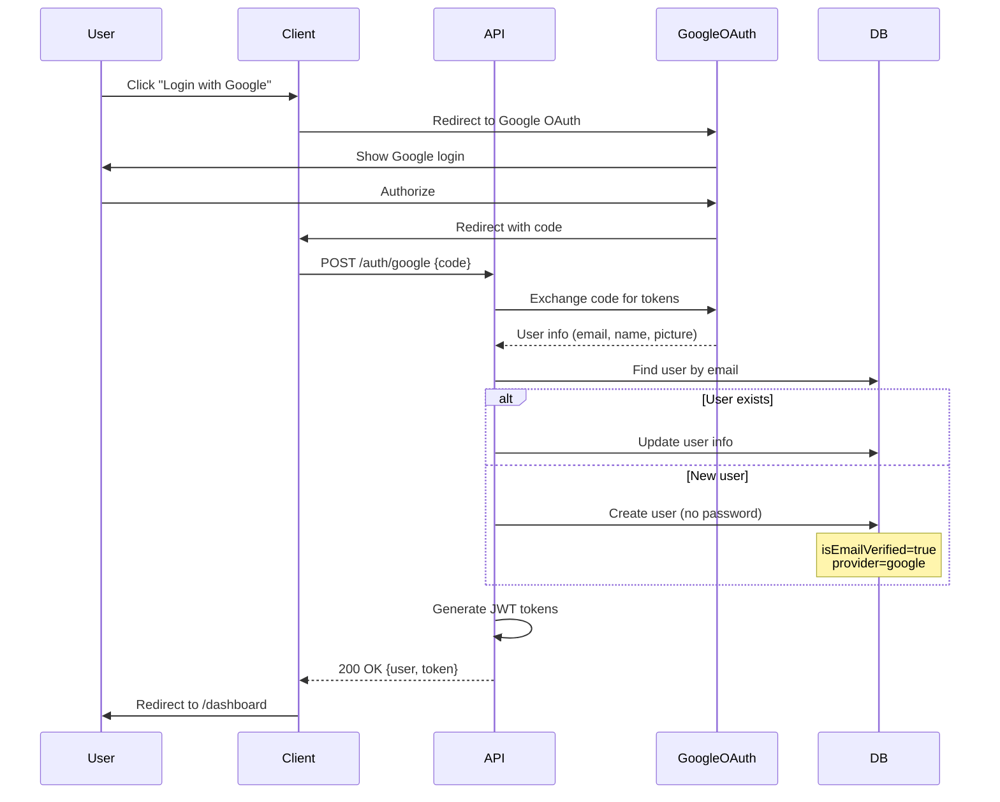

# Authentication Flows - Education OTT Platform

## Overview

Tài liệu này mô tả chi tiết các luồng authentication trong hệ thống.

---

## 1. Registration & Email Verification

### Current Implementation (Basic)



### Enhanced Implementation (Recommended)



**Key Differences:**
- ✅ User phải verify email trước khi login (production)
- ✅ RefreshToken được lưu trong Redis
- ✅ isActive flag để control access
- ⚠️ Current implementation cho phép login ngay (development)

---

## 2. Login & Token Refresh

### Current Implementation



### Enhanced with Refresh Token



**Token Strategy:**
- **AccessToken**: Short-lived (15min - 1h), stored in localStorage
- **RefreshToken**: Long-lived (30d), stored in httpOnly cookie (more secure)
- Auto-refresh via Axios interceptor (transparent to user)

---

## 3. Password Reset Flow

### Current Implementation



**Security Considerations:**
- ✅ Reset token expires after 1 hour
- ✅ Token stored in DB for verification
- ✅ Don't reveal if email exists (timing attack prevention)
- ✅ Token is single-use (cleared after reset)
- ✅ Auto-login after successful reset

---

## 4. Logout Flow

### Simple Logout (Current)



### Enhanced Logout with Token Blacklist



---

## 5. Protected Route Access



---

## 6. Role-Based Authorization



---

## 7. Social Login (Future Feature)



---

## Token Details

### AccessToken (JWT)

```javascript
// Payload
{
  id: "user_id_here",
  iat: 1234567890,      // Issued at
  exp: 1234567890       // Expires at
}

// Generated with
jwt.sign({ id: user._id }, process.env.JWT_SECRET, {
  expiresIn: '7d'  // or '15m' for short-lived
});
```

### RefreshToken (JWT)

```javascript
// Payload
{
  id: "user_id_here",
  type: "refresh",
  iat: 1234567890,
  exp: 1234567890
}

// Generated with
jwt.sign(
  { id: user._id, type: 'refresh' }, 
  process.env.JWT_REFRESH_SECRET, 
  { expiresIn: '30d' }
);
```

### Password Reset Token

```javascript
// Generated with
jwt.sign(
  { id: user._id }, 
  process.env.JWT_SECRET, 
  { expiresIn: '1h' }
);

// Stored in DB
user.resetPasswordToken = token;
user.resetPasswordExpire = Date.now() + 3600000; // 1 hour
```

---

## Security Best Practices

### ✅ Implemented

- [x] Password hashing with bcrypt (salt rounds: 10)
- [x] JWT for stateless authentication
- [x] Token expiry (7 days for access token)
- [x] HTTPS only (production)
- [x] Rate limiting (100 req/15min)
- [x] Input validation (express-validator)
- [x] MongoDB injection prevention (express-mongo-sanitize)
- [x] XSS protection (sanitize inputs)

### 🚀 Recommended Enhancements

- [ ] Implement RefreshToken rotation
- [ ] Short-lived AccessToken (15min instead of 7d)
- [ ] Store RefreshToken in httpOnly cookies
- [ ] Token blacklist in Redis (for logout)
- [ ] Email verification required before login
- [ ] Password strength requirements (8+ chars, numbers, special chars)
- [ ] Account lockout after failed login attempts
- [ ] Two-factor authentication (2FA)
- [ ] Session management (track active devices)
- [ ] CSRF protection
- [ ] Audit logging (login attempts, password changes)

---

## Error Handling

### Common Authentication Errors

| Error Code | Message | Scenario |
|------------|---------|----------|
| 400 | Email already registered | Registration with existing email |
| 400 | Invalid or expired token | Reset/verify token expired |
| 401 | Invalid email or password | Wrong credentials |
| 401 | You are not logged in | No token provided |
| 401 | Invalid token | Malformed or tampered JWT |
| 401 | Token expired | AccessToken expired |
| 401 | Account deactivated | User.isActive = false |
| 403 | No permission | Role-based access denied |

---

## Testing Checklist

### Registration
- [ ] Valid registration succeeds
- [ ] Duplicate email fails
- [ ] Invalid email format fails
- [ ] Weak password fails
- [ ] Missing required fields fails

### Login
- [ ] Valid credentials succeed
- [ ] Invalid credentials fail
- [ ] Inactive account fails
- [ ] Token is returned and valid
- [ ] LastLogin timestamp updated

### Token Refresh
- [ ] Valid RefreshToken returns new AccessToken
- [ ] Expired RefreshToken fails
- [ ] Invalid RefreshToken fails
- [ ] Blacklisted token fails

### Password Reset
- [ ] Reset email sent for valid email
- [ ] Reset with valid token succeeds
- [ ] Expired token fails
- [ ] Invalid token fails
- [ ] Token is single-use

### Authorization
- [ ] Protected routes require authentication
- [ ] Role restrictions work correctly
- [ ] Expired token redirects to login

---

## Migration Path (Current → Enhanced)

### Phase 1: Add RefreshToken
1. Update `/auth/login` to return refreshToken
2. Create `/auth/refresh` endpoint
3. Update Axios interceptor for auto-refresh
4. Store refreshToken in httpOnly cookie

### Phase 2: Shorten AccessToken TTL
1. Change JWT_EXPIRE from 7d → 15m
2. Test auto-refresh flow
3. Monitor for issues

### Phase 3: Email Verification
1. Make isEmailVerified required for login
2. Implement email sending (Nodemailer)
3. Add verification UI flow

### Phase 4: Advanced Security
1. Implement token blacklist (Redis)
2. Add 2FA support
3. Session management
4. Audit logging

---

## Related Documentation

- [API.md](./API.md) - API endpoints reference
- [DATABASE.md](./DATABASE.md) - User model schema
- [DEPLOYMENT.md](./DEPLOYMENT.md) - Environment variables setup

---

**Last Updated:** 2024-02-05
**Status:** Current implementation is basic but functional. Enhancements recommended for production.